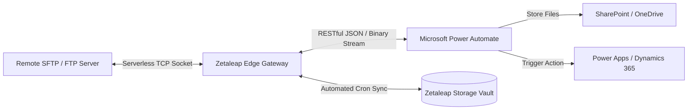

# Zetaleap SFTP / FTP Storage Vault: Power Automate & Cloud Integration Gateway

> **Fast, Serverless, and Secure SFTP / FTP RESTful API Gateway**  
> *Transform legacy SFTP and FTP servers into clean REST APIs for Microsoft Power Automate, Power Apps, and Cloud Workflow Automation.*

> [!NOTE]
> **Hosted Service Documentation & Integration Reference:**  
> This repository provides the official architectural documentation, REST API reference, and ready-to-use Power Automate integration templates for the hosted **Zetaleap SFTP / FTP Cloud Gateway** service. It is not an open-source self-hosted codebase. The accompanying MIT License applies to the documentation, code snippets, and automation flow templates provided herein.

---

## 📌 Overview & Purpose

Integrating external SFTP or legacy FTP servers into **Microsoft Power Automate** and **Power Apps** has historically presented major architectural hurdles:

* **On-Premises Data Gateway (OPDG) Overhead:** While internet-routable SFTP servers can connect directly, legacy internal servers, custom ports, or strict corporate firewall rules often mandate deploying, maintaining, and monitoring Windows-based On-Premises Data Gateways.
* **Flow Timeouts & Payload Limits:** Directory listings and transfers on slower legacy servers frequently exceed Power Automate's 120-second connector timeout boundary.
* **No Built-in Browser Inspection:** Troubleshooting failed flows requires third-party desktop tools (such as FileZilla) because standard cloud flows provide no visual directory explorer prior to execution.
* **Plain FTP Incompatibilities:** Legacy plain FTP endpoints lack modern cloud connector support in Microsoft 365 environments.

**Zetaleap SFTP / FTP Storage Vault** solves these challenges by functioning as a high-performance serverless TCP bridge running on Cloudflare's global edge network. It translates remote SFTP (Port 22) and FTP (Port 21) protocols into lightweight, predictable **RESTful JSON APIs**.

With this gateway, Power Automate flows can list, stream, and download files using standard **HTTP REST actions**—bypassing gateway maintenance and connection timeouts.

---

## 🏛️ Architecture Workflow



---

## 🛡️ Security, Privacy & Data Handling

Enterprise automation requires strict compliance and zero data-leakage guarantees:

* **Zero Data Retention for Live Streams:** When listing directories or downloading files on-demand, the Zetaleap Gateway operates strictly as an in-memory streaming proxy. File content is streamed directly over encrypted TLS connections between the remote host and Power Automate; **no customer file contents are ever stored on disk or cached on gateway servers**.
* **Isolated Vault Storage (R2):** Only when you explicitly configure **Automated Sync Schedules (Cron)** are files ingested into encrypted cloud object storage (Cloudflare R2, AES-256 at rest), fully partitioned per organization.
* **Encrypted Credentials:** Remote SFTP passwords and SSH private keys (PEM) are encrypted at rest using industry-standard AES-256 encryption.
* **Global Edge Infrastructure:** Deployed across Cloudflare's Tier IV data centers, adhering to strict GDPR and SOC2 compliance standards.
* **Plain FTP Security Advisory:**
  > [!WARNING]
  > Plain FTP (Port 21) transmits authentication credentials and file payloads in unencrypted cleartext across the network. While supported for legacy compatibility, **SFTP (Port 22, SSH/TLS) is strongly recommended** for all production and enterprise workflows.

---

## ✨ Key Features

* **⚡ Native RESTful Gateway:** Access remote SFTP (Password or SSH Key) and FTP endpoints over clean, standardized HTTPS endpoints.
* **🧭 Browser-Based Live Remote Explorer:** Inspect, navigate, and download files directly from your browser via native serverless TCP sockets without installing FTP desktop software.
* **⏱️ Automated Scheduled Background Sync (Cron):** Ingest remote files into **Zetaleap Storage Vault** on customizable recurring schedules (Hourly, Daily, Custom Cron) with optional Move/Cut-Paste mode.
* **🔑 Self-Service Personal Access Tokens (PAT):** Generate secure Bearer API tokens directly from your user profile with instant activation.
* **🗑️ Complete Endpoint Lifecycle Management:** Add, configure, test, and safely delete custom connection profiles directly from the web interface.
* **🛡️ Enterprise Role-Based Access Control:** Protect sensitive automated background cron tasks with administrator-only permissions.

> [!IMPORTANT]
> ### 🔒 Administrative Authorization Required for Automated Sync Schedules
>
> While all registered users with an active Personal Access Token (API Key) can configure remote connections, browse files in **Live Explorer**, and integrate on-demand file transfers directly within **Microsoft Power Automate**, setting up **Automated Sync Schedules (Recurring Cron Tasks)** requires elevated privileges:
>
> * **Role-Based Protection:** Creating, modifying, or triggering scheduled synchronization tasks requires system administrator privileges or explicit **SFTP Cron** authorization granted by a system administrator in the Admin Portal.
> * **Resource Protection:** This policy safeguards enterprise network bandwidth and cloud storage resources against accidental high-frequency polling or unauthorized loop executions.
> * **Requesting Schedule Access:** Non-admin users attempting to configure automated sync schedules will be presented with a Security Alert prompt. To request cron schedule permissions for your account, contact the system administration team at [support_team@zetaleap.com](mailto:support_team@zetaleap.com).

---

## 🚀 Power Automate Integration Guide

> [!TIP]
> **Prerequisites & Best Practices:**
> * **Licensing Note:** The `HTTP` action in Power Automate requires a **Power Automate Premium** or per-user/process license.
> * **Connection Identifiers:** In the examples below, `rebex` refers to the public demo SFTP profile. In your own flows, replace `rebex` with your custom connection slug/ID registered in the portal (e.g., `https://zetaleap.com/api/sftp/{your_connection_id}`).
> * **Token Security:** Do not hardcode Personal Access Tokens (PAT) in plain text within production flows. Store them securely in **Power Automate Environment Variables** or **Azure Key Vault**, and enable **Settings > Secure Inputs** and **Secure Outputs** on HTTP actions to prevent token leakage in run history logs.
> *(The token `zl_pat_3f9a7c8e2b1d40a5bc8e9102` shown below is a dummy token for illustration purposes).*

### Scenario 1: List Remote SFTP Files in Power Automate

Add a standard **HTTP** action to your Cloud Flow:

1. **Add Action:** `HTTP`
2. **Method:** `GET`
3. **URI:** 
   ```http
   https://zetaleap.com/api/sftp/{connection_slug}?path=/
   ```
4. **Headers:**
   ```http
   Authorization: Bearer @{parameters('ZETALEAP_PAT')}
   ```

#### Sample Response Payload:
```json
{
  "success": true,
  "target_path": "/",
  "files": [
    {
      "filename": "orders_2026_10.csv",
      "size": 154200,
      "is_dir": false,
      "modify_time": "2026-10-04T18:00:00Z"
    },
    {
      "filename": "readme.txt",
      "size": 405,
      "is_dir": false,
      "modify_time": "2026-10-01T12:00:00Z"
    },
    {
      "filename": "inbox",
      "size": 0,
      "is_dir": true,
      "modify_time": "2026-10-01T12:00:00Z"
    }
  ]
}
```

5. **Parse JSON Action Schema:**
```json
{
  "type": "object",
  "properties": {
    "success": { "type": "boolean" },
    "target_path": { "type": "string" },
    "files": {
      "type": "array",
      "items": {
        "type": "object",
        "properties": {
          "filename": { "type": "string" },
          "size": { "type": "integer" },
          "is_dir": { "type": "boolean" },
          "modify_time": { "type": "string" }
        }
      }
    }
  }
}
```

---

### Scenario 2: Download File & Save to SharePoint

Once files are listed, download and store them into a SharePoint document library:

1. **Add Action:** `Apply to each` using `body('Parse_JSON')?['files']`
2. **Add Condition:** `item()?['is_dir'] is equal to false`
3. **Add Action inside Condition:** `HTTP (Download Remote File)`
   * **Method:** `GET`
   * **URI (URL-Encoded):** 
     ```http
     https://zetaleap.com/api/sftp/{connection_slug}/download?file=@{encodeUriComponent(items('Apply_to_each')?['filename'])}
     ```
     *(Note: If downloading from a subfolder, include the full relative path, e.g. `?file=@{encodeUriComponent(concat('/inbox/', items('Apply_to_each')?['filename']))}`)*
   * **Headers:**
     ```http
     Authorization: Bearer @{parameters('ZETALEAP_PAT')}
     ```
4. **Add Action:** `SharePoint - Create file`
   * **Site Address:** `https://yourtenant.sharepoint.com/sites/Automation`
   * **Folder Path:** `/Shared Documents/SFTP Ingestion`
   * **File Name:** `@{items('Apply_to_each')?['filename']}`
   * **File Content:** `body('HTTP_Download')`

---

### Scenario 3: On-Demand File Access via Power Apps

1. The user clicks a button in **Power Apps** (e.g., *"Fetch Vendor Invoice"*).
2. Power Apps passes the invoice number or filename to a Power Automate flow.
3. The flow queries the Zetaleap gateway:
   ```http
   GET https://zetaleap.com/api/sftp/{connection_slug}/download?file=@{encodeUriComponent(triggerBody()['text'])}
   ```
4. The flow returns the file binary or email attachment directly to the user in seconds.

---

## 🛠️ Step-by-Step Setup

1. **Create an Account & Sign In:**  
   Navigate to [zetaleap.com/login](https://zetaleap.com/login) and log in.

2. **Generate a Personal Access Token (API Key):**  
   Go to **My Profile** > **Personal Access Tokens** > click **Generate Token**. Copy your new Bearer token and store it securely.

3. **Register your SFTP/FTP Connection:**  
   Open **SFTP / FTP Storage Vault** > **➕ New Connection**.  
   * **Protocol:** `SFTP` (Port 22) or `FTP` (Port 21)
   * **Host & Port:** Target server host/IP
   * **Authentication:** Password or SSH Private Key (PEM)
   * **Default Root Path:** Target initial directory (e.g., `/` or `/inbox`)

4. **Verify Live Explorer:**  
   Switch to **Live Explorer** to browse remote directories in real time directly from your browser.

5. **Copy Ready-to-Use Snippets:**  
   Under **API & cURL Docs**, select your connection and token to view pre-populated cURL commands and copy them directly into your Power Automate flows.

---

## 📡 API Reference Summary

| Action | HTTP Method | Endpoint URI | Description |
| :--- | :---: | :--- | :--- |
| **List Directory** | `GET` | `/api/sftp/{connection_slug}?path=/` | Returns JSON list of files and subdirectories. |
| **Download File** | `GET` | `/api/sftp/{connection_slug}/download?file={path}` | Streams the binary file content directly. |
| **List Saved Connections**| `GET` | `/api/sftp/companies` | Returns all configured SFTP/FTP profiles. |
| **Delete Connection** | `DELETE` | `/api/sftp/companies/{connection_slug}` | Deletes a custom connection profile. |
| **List Storage Vault** | `GET` | `/api/sftp/r2/files` | Lists archived files in Zetaleap Storage Vault. |
| **Download from Vault** | `GET` | `/api/sftp/r2/download?key={key}` | Downloads an ingested file from storage. |

---

## 🛑 API Status & Error Codes

| Status Code | Reason | Resolution |
| :---: | :--- | :--- |
| `200 OK` | Success | Request processed and payload returned. |
| `400 Bad Request` | Missing / Invalid Parameters | Verify `path` or `file` parameters and ensure values are URL-encoded. |
| `401 Unauthorized` | Invalid / Missing Token | Ensure Bearer PAT token is valid and active in your user profile. |
| `403 Forbidden` | Insufficient Permissions | User account lacks administrative privilege (e.g., Cron Sync setup). |
| `404 Not Found` | Remote File / Path Not Found | Verify the target directory or filename exists on the remote SFTP/FTP server. |
| `429 Too Many Requests` | Rate Limit Exceeded | Flow polling frequency is too high. Introduce a delay or utilize Scheduled Sync. |
| `502 Bad Gateway` | Remote Host Connection Failure | Remote server unreachable, authentication rejected, or port blocked by firewall. |
| `504 Gateway Timeout` | Remote Host Unresponsive | Remote host timed out during TCP handshake or socket transmission. |

---

## 🔌 Future Roadmap: Custom Connector & OpenAPI

An official OpenAPI v3 / Swagger specification is currently in development to allow one-click **Custom Connector** import into Power Platform solutions, further simplifying flow authoring without manual HTTP action configuration.

---

## 📋 Requirements

* Microsoft Power Automate subscription (Cloud Flows with Premium HTTP access)
* Basic familiarity with HTTP actions and JSON parsing in Power Automate or Power Apps
* A valid Zetaleap account and Personal Access Token (PAT)

---

## 🤝 Contributions & Feedback

Contributions, feedback, and feature suggestions are welcome! Feel free to open an issue or submit a pull request on GitHub.

---

## 📄 License

This documentation and template collection is licensed under the [MIT License](LICENSE).

---

## 👨‍💻 Author & Credits

Created and maintained by **[korhanh](https://github.com/korhanh)**.  
*Power Platform, Cloud Integration & Automation Specialist*

⭐ **If you find this gateway useful in your Power Automate workflows, please consider starring this repository on GitHub!**
